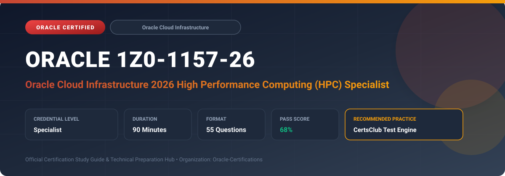

  

# Oracle 1Z0-1157-26: Oracle Cloud Infrastructure 2026 High Performance Computing (HPC) Specialist

---

## 1. Exam Overview & Candidate Profile

The **Oracle 1Z0-1157-26: Oracle Cloud Infrastructure 2026 High Performance Computing (HPC) Specialist** certification validates specialists who architect, deploy, and benchmark compute-intensive HPC, AI supercomputing, and GPU clusters on OCI.

Candidates prove their ability to configure Cluster Networks with RoCE v2 RDMA, bare metal GPU shapes (NVIDIA H100/A100), parallel file systems (Lustre/BeeGFS), Slurm workload managers, and MPI tuning.

### Target Audience & Prerequisites
- **Target Roles**: Implementation Specialists, Cloud Architects, Technical Leads, Enterprise Consultants, and Systems Engineers.
- **Recommended Experience**: 1–2 years of practical, hands-on experience designing, implementing, and maintaining corresponding Oracle solutions.
- **Credential Earned**: Specialist Certification.

---

## 2. Key Exam Specifications

| Specification | Details |
| :--- | :--- |
| **Exam Code** | **Oracle 1Z0-1157-26** |
| **Official Title** | Oracle Cloud Infrastructure 2026 High Performance Computing (HPC) Specialist |
| **Certification Track** | Oracle Cloud Infrastructure |
| **Exam Duration** | 90 Minutes |
| **Number of Questions** | 55 Questions |
| **Passing Score** | 68% |
| **Question Format** | Multiple Choice (Single/Multiple Answer), Scenario-Based Questions |
| **Delivery Provider** | Oracle University / Pearson VUE (Online Proctored or Test Center) |
| **Recommended Practice Engine** | [CertsClub Oracle Practice Tests](https://www.certsclub.com/oracle/1z0-1157-26-dumps.html) |

---

## 3. Official Blueprint & Exam Domain Breakdown

The examination assesses candidate competencies across core functional domains weighted as follows:

| Domain Area | Weighting |
| :--- | :--- |
| **OCI HPC & AI Supercomputing Architecture** | `25%` |
| **Cluster Networks & RoCE v2 (RDMA) Configuration** | `25%` |
| **High-Performance Parallel Storage (Lustre, BeeGFS, FSS)** | `20%` |
| **HPC Workload Schedulers (Slurm) & MPI Optimization** | `15%` |
| **Benchmarking, Cost Optimization & Operational Best Practices** | `15%` |

---

## 4. Deep Dive into Complex & Challenging Technical Topics

To secure a passing score on the 1Z0-1157-26 exam, candidates must master the following advanced concepts:

- Deploying Cluster Networks utilizing Remote Direct Memory Access (RDMA) over Converged Ethernet (RoCE v2) for sub-2-microsecond latency.
- Configuring NVIDIA GPU bare metal shapes with NVLink and NVSwitch interconnects for large-scale AI distributed training.
- Deploying high-throughput parallel file systems (Lustre, BeeGFS) on NVMe dense I/O storage pools.
- Automating HPC cluster provisioning using Terraform HPC modules and Slurm autoscaling.
- Profiling and benchmarking MPI communications (OpenMPI, Intel MPI) and NCCL collective operations.

---

## 5. Scenario-Based Demo & Practice Questions

### Question 1
What networking technology enables OCI Cluster Networks to achieve ultra-low, sub-2-microsecond inter-node communication latency required for distributed AI training and tightly-coupled MPI simulations?

A) RDMA over Converged Ethernet (RoCE v2)
B) Standard TCP/IP NAT Routing
C) IPSec VPN Tunneling
D) Public Internet Gateway

- **Correct Answer**: `A) RDMA over Converged Ethernet (RoCE v2)`  
- **Technical Explanation**: OCI Cluster Networks use RoCE v2 (RDMA over Converged Ethernet) to bypass the OS kernel and CPU, enabling direct memory-to-memory data transfers with microsecond latency.

---

### Question 2
Which distributed parallel file system is commonly deployed on OCI dense NVMe compute instances to provide millions of IOPS and hundreds of GB/s throughput for HPC job checkpoints?

A) Lustre
B) Standard FAT32
C) Local Ext4 partition
D) Single-instance NFS

- **Correct Answer**: `A) Lustre`  
- **Technical Explanation**: Lustre is a high-performance parallel file system widely used in supercomputing and HPC environments on OCI to feed data to thousands of GPU/CPU cores simultaneously.

---

## 6. Recommended Preparation Strategy & Practice Testing Engine

Achieving certification in **Oracle 1Z0-1157-26** requires balanced theoretical study and scenario-based simulation practice:

1. **Review Oracle Documentation**: Master architecture guides, implementation workbooks, and administration manuals on the Oracle Help Center.
2. **Hands-on Lab Practice**: Execute real-world configuration, policy setup, and troubleshooting tasks in your cloud tenancy or test instance.
3. **Simulated Exam Drills**: Practice answering timed, scenario-based multiple-choice questions to familiarize yourself with the question formats, traps, and timing constraints.

### Practice With CertsClub
For realistic practice questions, updated dumps, and mock testing environments:
- **Resource**: [CertsClub Oracle Practice Test Engine](https://www.certsclub.com/oracle/1z0-1157-26-dumps.html)
- **Special Discount**: Use coupon code **`club20`** during checkout for an instant **20% discount** on all practice exam bundles and testing engines.

---

## 7. Official Documentation & References

- [Oracle University Certification Registry](https://education.oracle.com/)
- [Oracle Help Center Documentation Portal](https://docs.oracle.com/)
- [Oracle Cloud Infrastructure & Applications Guides](https://docs.oracle.com/en/cloud/)
- [CertsClub Oracle Certification Exam Practice](https://www.certsclub.com/oracle/1z0-1157-26-dumps.html)

---

## 8. SEO & Discovery Keywords

`oracle 1z0-1157-26, oracle 1z0-1157-26 exam, oracle 1z0-1157-26 dumps, 1Z0-1157-26 practice questions, 1Z0-1157-26 study guide, oracle cloud infrastructure 2026 high performance computing specialist, certsclub 1z0-1157-26`